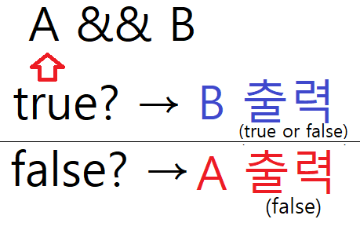
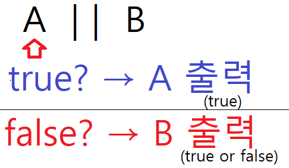

# 7강. 논리 연산자 (AND, OR, NOT)
## 특징
- OR ( || ) : 첫번째 true를 발견하는 즉시 평가를 멈춘다.
- AND ( &&) : 첫번째 false를 발견하는 즉시 평가를 멈춘다.
- 평가를 할 때 비율이 낮은 것부터 순서대로 나열해야 시간이 단축되고 성능이 최적화된다.
- NOT ( ! ) : true라면 false, false라면 true
---
## 우선순위
- AND가 OR보다 우선이다.
```javascript
const gender = 'F';
const name = 'Jane';
const isAdult = true;

if(gender === 'M' && name === 'Mike' || isAdult) {
console.log('통과');
} else {
console.log('돌아가');
}
// 결과 : "통과"
```
- 결과가 "통과"로 나오는 이유
	1. AND가 OR보다 우선순위가 높음으로 인해 gender === 'M' && name === 'Mike' 연산이 먼저 수행된다. false && false 가 되므로 true로 연산된다.
	2. 그다음 true || isAdult가 연산되어 true || true, 곧 if문은 true가 되고 "통과"를 출력하며 빠져나온다.
---
## 연산
- AND 연산 ( && )
```js
console.log(true && true); //	true (뒤의 값)
console.log(true && false); // false (뒤의 값)
console.log(false && true); // false (앞의 값)
console.log(false && false); // false (앞의 값)
```
- 설명

  - `A && B` 의 연산을 수행할 경우 `A`가 `true`라면 AND 연산의 결과는 뒤의 `B` 값에 따라서 `true`인지` false`인지 나뉘게 된다. 
  -  따라서, 앞의 `A`가 `true`일 경우 결과로 `B`의 값을 출력하게 된다.
  -  반면, 앞의 `A`가 `false`일 경우 `B`의 경우를 따질 것도 없이 `false`가 출력된다. 
- OR 연산 ( || )
 ```js
console.log(true || true); //	true (앞의 값)
console.log(true || false); // true (앞의 값)
console.log(false || true); // true (뒤의 값)
console.log(false | false); // false (뒤의 값)
```
- 설명

  - `A && B` 의 연산을 수행할 경우 `A`가 `true`라면 OR 연산의 결과는 뒤의 `B`가 어떤 값인지 상관없이 무조건 `true`값을 가지게 된다.
  - 따라서, `A`가 `true`일 경우, 바로 `A` 값을 출력하게 된다.
  - 반면, `A`가 `false`일 경우, 뒤의 `B`가 어떤 값인지에 따라 결과가 달라진다.
