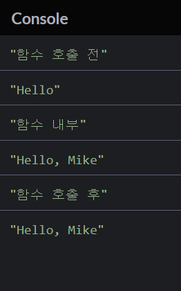
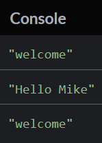

# 9강. 함수(function)
## 기본형
```javascript
//함수   함수명  매개변수
function sayHello(name) {
  console.log(`Hello, ${name}`);
}
sayHello('Mike');  // 'Mike'라는 인자를 넣고 sayHello 함수 실행
```
---
## 전역변수와 지역변수
- 예제 코드 1
```javascript
let msg = 'Hello';  // 전역 변수 (global variable)
console.log('함수 호출 전');
console.log(msg); // "Hello"

function sayHello(name) {
  if(name) {
    msg += `, ${name}`;
  }
console.log('함수 내부');
 // 지역 변수 (local variable)
console.log(msg);
}

sayHello('Mike'); // "Hello, Mike"
console.log('함수 호출 후');
console.log(msg); // "Hello, Mike"
```
  - 결과  

  - 설명
    - 함수 호출 전 : let msg가 "Hello"로 할당되었으므로 console.log(msg)는 "Hello"가 출력된다.
    - 함수 내부 : sayHello('Mike')라는 함수가 실행되었고, msg는 "Hello, Mike"로 재할당된다. 그러므로 console.log(msg)는 "Hello, Mike"가 출력된다.
    - 함수 호출 후 : msg는 이미 sayHello 함수를 거쳐 "Hello, Mike"로 재할당 되었으므로 그대로 console.log(msg)는 "Hello, Mike"가 출력된다.

- 예제 코드 2
```js
let msg = 'Welcome';  // 전역 변수 
console.log(msg); // 전역 변수 출력 -- 1️⃣

function sayHello(name) {
  let msg = 'Hello';  // 지역 변수 -- 2️⃣
  console.log(`${msg} ${name}`);
}

sayHello('Mike'); // 지역 변수 출력 -- 3️⃣
console.log(msg); // 전역 변수 출력 -- 4️⃣
```
  - 결과  
  
  - 설명
    - 1️⃣ 함수 밖에서 let msg가 'Welcome'으로 할당되었다. 이것은 **전역 변수**로써, 전체 범위에서 작동을 한다. 그리하여 console.log로 msg를 출력 시, <u>결과값은 "Welcome"이 된다.</u>
    - 2️⃣ sayHello(name) 함수 안에서 let msg가 'Hello'로 할당되었다. 이것은 함수 안에서만 작동하는 **지역 변수**로써, function 밖에서는 사용할 수가 없다.
    - 3️⃣ sayHello('Mike')라는 함수를 호출함으로써, 지역변수인 msg = 'Hello'가 작동하게 되고 <u>결과값으로 "Hello Mike"가 출력된다</u>
    - 4️⃣ console.log로 msg를 출력하게 되는데 여기서 msg는 전역변수에 해당하므로 앞서 전역 변수로 할당했던 <u>"Welcome"이 출력된다.</u>
- 전역 변수가 많아지면 관리가 힘들어지므로 전체에 작동하는 변수를 제외하고는 함수에 특화된 지역 변수를 쓰는 습관을 들이도록 한다.
---
## 함수의 초기값 지정
- function을 선언할 때 인자의 초기값을 지정할 수도 있다.
  ```js
  function sayHello(name = 'friend') {
    let msg = `Hello, ${name}`;
    console.log(msg);
  }

  sayHello(); 
  // 따로 입력한 인자가 없으므로 함수의 초기값 'friend'를 인자로 사용
  
  sayHello('Jane'); 
  // 'Jane'이라는 인자를 사용했으므로 함수의 인자는 'Jane'으로 사용

  /* 결과값
  "Hello, friend"
  "Hello, Jane"
  */
  ```
## return 으로 값 반환
- 함수 안에서 return문을 사용하여 결과값을 반환할 수 있다.
```js
function add(num1, num2) {
  return num1 + num2; 
  // add 함수로 받은 인자 num1과 num2를 더한 값을 반환한다.
}

const result = add(2,3);  // 2 + 3
console.log(result);
// 결과값 : 5
```
- return문이 없는 함수도 undefined를 반환한다.
```js
function showError() {
  alert('에러가 발생했습니다.');
  // return문이 존재하지 않으므로 undefined를 반환한다.
}
const result = showError(); // 반환된 undefined를 result에 할당
console.log(result);  // undefined 출력

// 결과 : undefined
```
- return문은 함수를 종료하는 목적으로도 사용된다.
```js
function showError() {
  alert('에러가 발생했습니다.');
  return; // return문으로 인해 함수를 종료한다. 반환값이 없으므로 undefined를 반환한다.
  alert('이 코드는 절대 실행되지 않습니다.'); // 함수가 종료되었으므로 이 코드는 실행되지 않는다.
}
const result = showError(); // 반환된 undefined를 result에 할당
console.log(result);  // undefined 출력
```
---
## 몇가지 팁
1. 한번에 한 작업만 집중한다. 여러 작업을 한다면 함수를 잘게 나누어 여러작업을 하도록 만든다.
1. 읽기 쉽고 어떤 동작인지 알 수 있게 이름을 짓는다.
2. 