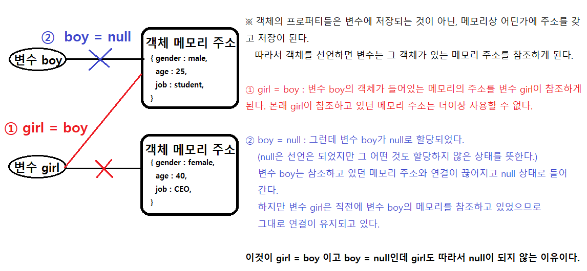

# 13강. 객체의 method, this
## method
- 정의 : 객체 프로퍼티로 할당 된 함수
  ```js
  const superman = {
    name : 'clark',
    age : 33,
    fly : function() {  // method, 객체 프로퍼티로 할당된 함수
    // fly() { } 으로 축약 가능

      console.log('날아갑니다.');
    }
  }
  superman.fly(); // "날아갑니다." 출력
  ```
---
## this
```js
const user = {
  name : 'Mike',
  sayHello : function() {
    console.log(`Hello, ${this.name}`)  // this가 가리키는 객체는 user가 된다.
  }
}  
```
- `this`는 실행하는 시점, 즉, 런타임에 의해서 무슨 객체를 가르키는지 결정된다.
- `this.[프로퍼티 키]`를 통해서 그 객체가 가지고 있는 프로퍼티 값에 접근할 수 있다.
- this 키워드를 사용해야 하는 이유
  ```js
  let boy = {
    name = 'Mike',
    showName: function() {
      console.log(boy.name) // this가 아닌 boy를 사용
    }
  };

  let man = boy;  // boy의 객체 메모리 주소 참조
  boy = null; // boy를 null 상태로 변경, 아무것도 없는 상태

  man.showName(); // 'Cannot read properties of null' 에러 발생
  ```
    - 에러의 원인 : 객체 `boy`의 method에서 프로퍼티를 `this`가 아닌 직접 `boy`로 지정했다. 이럴 경우 이를 참조하고 있던 객체 `man`은 나중에 `boy`가 `null`이 되면서 더이상 `boy.name`이란 프로퍼티를 불러올 수가 없는 상태가 된다. 그러므로 **'null의 프로퍼티를 읽을 수 없다'** 는 에러가 출력된다.
    - boy가 null이 되었는데 man도 따라서 null이 되지 않는 이유
   
- 객체 내의 method 안에서 사용하지만, 객체 외부에서도 `this` 키워드를 사용할 수 있다.
  ```js
  let jane = {
    name : "Jane",  // jane이라는 객체 생성
  }

  let mike = {
    name : "Mike",  // mike라는 객체 생성
  }

  function confirmUser() {
    console.log(`${this.name} 님 확인되었습니다.`);  // this를 이용하여 name 프로퍼티에 접근
  }

  jane.confirm = confirmUser; // jane객체에 confirm 프로퍼티 키를 추가하고 그 값을 confirmUser함수로 할당
  mike.confirm = confirmUser; // mike객체에 confirm 프로퍼티 키를 추가하고 그 값을 confirmUser함수로 할당

  jane.confirm(); // jane객체의 confirm 프로퍼티 호출 = confirmUser함수 호출
  mike.confirm(); // mike객체의 confirm 프로퍼티 호출 = confirmUser함수 호출

  /* 결과 : "Jane 님 확인되었습니다."
            "Mike 님 확인되었습니다."   */
  ```
  ---
  ## 화살표 함수에서의  this 사용
- 화살표 함수는 일반 함수와는 달리 자신만의 this를 가지지 않는다.
- 화살표 함수 내부에서 this를 사용하면, 그 this는 외부에서 객체를 가져온다.
- 외부에서 가져오는 객체를 전역객체라고 하며, 웹브라우저에서는 `window` 객체를, node.js 환경에서는 `global` 객체를 가져온다.